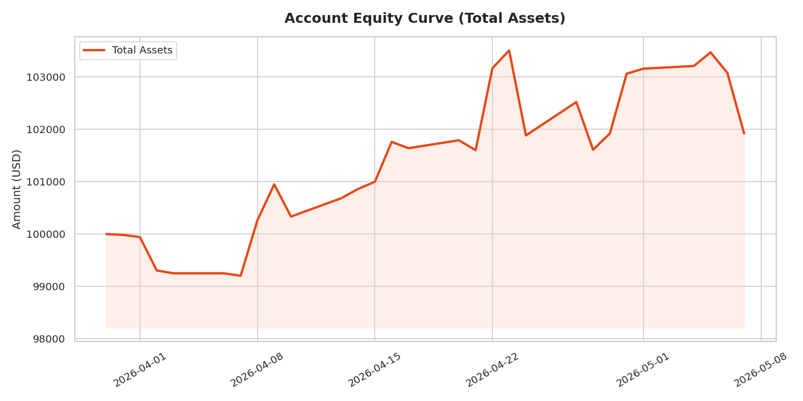
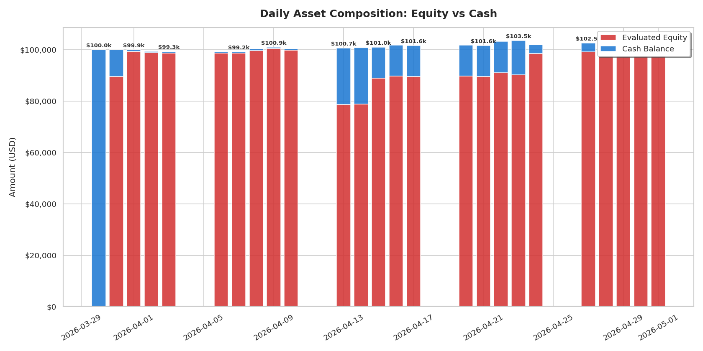

# micro-quant-simulator
This is the first version of simulator based on the data from lab-2
# 🚀 Micro Quant Simulator (低频量化回测与数据同步自动化系统)

这是一个基于 GitHub Actions 的全自动量化回测与数据同步系统。它能够每天定时从私有数据仓拉取最新的策略因子或行情数据，自动运行回测逻辑，并实时更新账户权益曲线。

## 📈 业绩可视化看板 (Performance Visualization)

> 系统每日回测完成后会自动更新以下图表。

### 1. 账户资产净值曲线 (Equity Curve)

### 2. 每日资产构成 (Equity vs Cash)

---

## 🌟 核心功能 (Core Features)

- **跨仓自动化同步**：通过 GitHub Fine-grained PAT 令牌，安全地从私有数据仓 (`micro-quant-trading-lab-2`) 检出数据。
- **每日定时回测**：每天纽约时间 24:00 (UTC 04:00) 自动触发回测任务。
- **动态行情集成**：内置 `yfinance` 支持，自动获取美股实时行情。
- **资产追踪 (Equity Tracking)**：自动生成并更新 `daily_equity.csv`，记录账户每日净值变化。
- **业绩看板自动更新**：自动生成可视化 PNG 图片并反馈至 README。

## 🏗️ 系统架构 (Architecture)

1. **Trigger**: 每天凌晨定时启动或手动点击 `Workflow Dispatch`。
2. **Environment**: 启动 Ubuntu 最新版虚拟机，配置 Python 3.9 环境。
3. **Data Sync**: 使用 `insteadOf` 认证方式同步私有仓数据。
4. **Execution**: 运行 `sync_data.py` 驱动回测引擎。
5. **Visualization**: 运行 `visualizer.py` 生成最新业绩图表。
6. **Commit**: 将生成的 `daily_equity.csv` 和 `.png` 图表自动推送回仓库。
